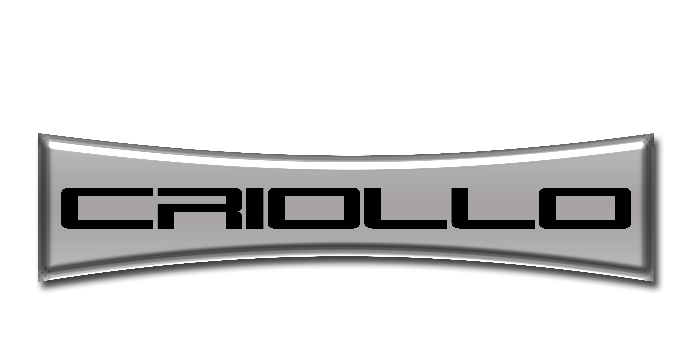

# Criollo Life

Welcome to Criollo Life - Your Ultimate Offroad and Overland Adventure Documentation Platform!

## Overview

Criollo Life is a React-based web application dedicated to documenting and sharing travel adventures, with a particular focus on offroad and overland journeys across the United States. Whether you're an explorer seeking new destinations or an offroad enthusiast craving adrenaline-fueled experiences, Criollo Life has been crafted to cater to your passion.

## Features

- **Explore**: Dive into a diverse collection of documented travel experiences, routes, and destinations.
- **Offroad and Overland Focus**: Tailored content for those who crave the excitement of offroad and overland exploration.
- **Interactive Maps**: Visualize routes, waypoints, and key locations using interactive maps.
- **Styling with React Bootstrap**: Utilizes React Bootstrap for a sleek and responsive user interface.
- **Animations with Framer Motion**: Enhance the user experience with smooth animations powered by Framer Motion.
- **Iconography with React Icons**: Access a variety of icons seamlessly integrated into the project using React Icons.
- **Routing with React Router Dom**: Utilizes React Router Dom for efficient client-side routing.

## Getting Started

### Prerequisites

- [Node.js](https://nodejs.org/) installed on your machine.
- [npm](https://www.npmjs.com/) package manager.

### Installation

1. Clone the repository: `git clone https://github.com/gianmachella/criollo-life-web.git`
2. Navigate to the project directory: `cd criollo-life-web`
3. Install dependencies: `npm install`

### Usage

1. Start the development server: `npm start`
2. Open your browser and visit [http://localhost:3000](http://localhost:3000)

## Contributing

We welcome contributions from the community. If you have an idea for improvement, feel free to submit a pull request. Make sure to follow our [Contribution Guidelines](CONTRIBUTING.md).

## License

This project is licensed under the MIT License - see the [LICENSE.md](LICENSE.md) file for details.

## Contact

For inquiries and support, contact us at [contact@criollolife.com](mailto:contact@criollolife.com).

---

**Embark on Your Journey with Criollo Life!**
